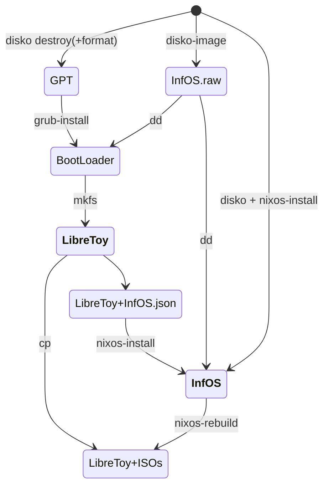

# Bootstrapping LibreToy and InfOS

```mermaid
stateDiagram
  classDef bold font-weight:bold

  [*] --> GPT: disko destroy(+format)
  GPT --> BootLoader: grub-install
  BootLoader --> LibreToy:::bold: mkfs
  LibreToy --> LibreToy+ISOs: cp
  LibreToy --> LibreToy+InfOS.json
  LibreToy+InfOS.json --> InfOS: nixos-install
  [*] --> InfOS.raw: disko-image
  InfOS.raw --> BootLoader: dd
  InfOS.raw --> InfOS:::bold: dd
  [*] --> InfOS: disko + nixos-install
  InfOS --> LibreToy+ISOs: nixos-rebuild
```
